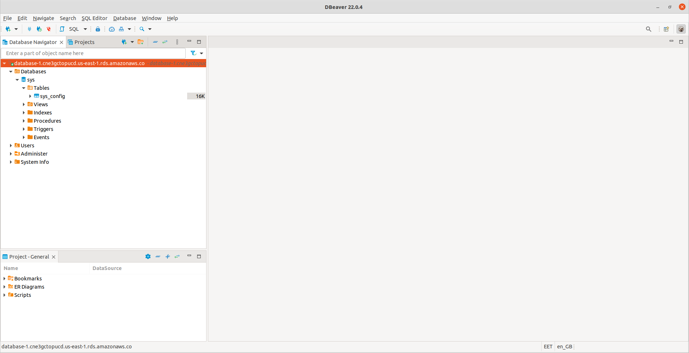
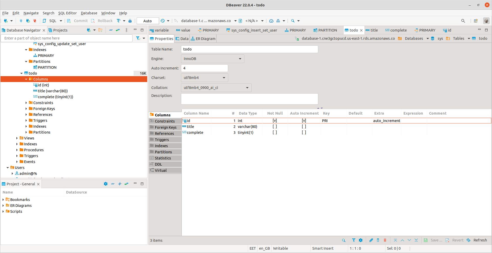
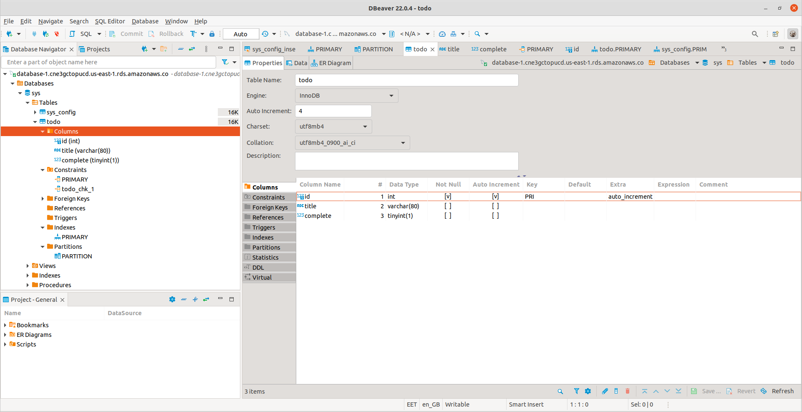
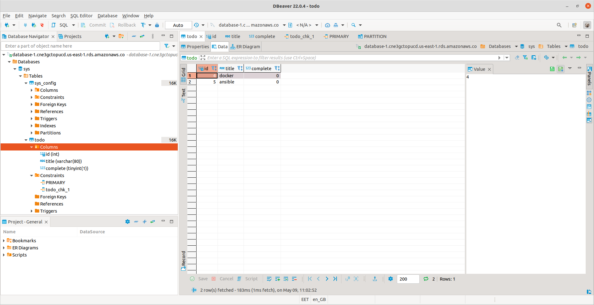
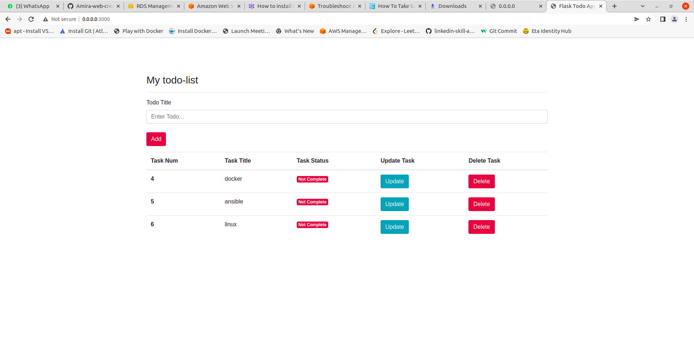
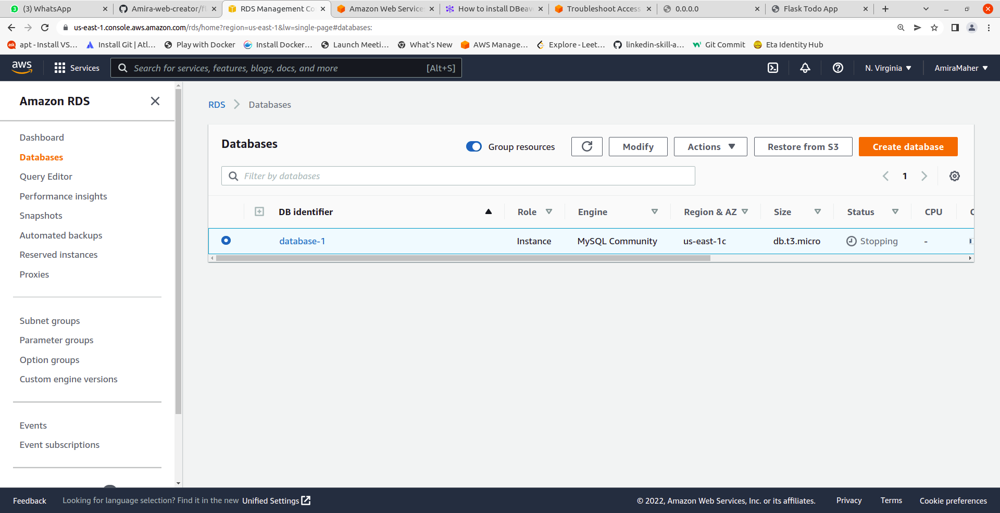
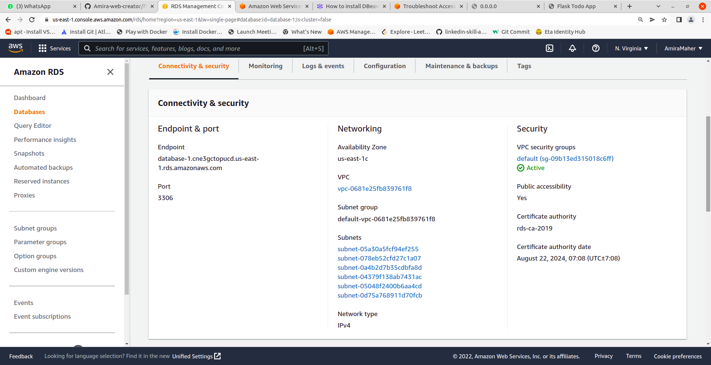
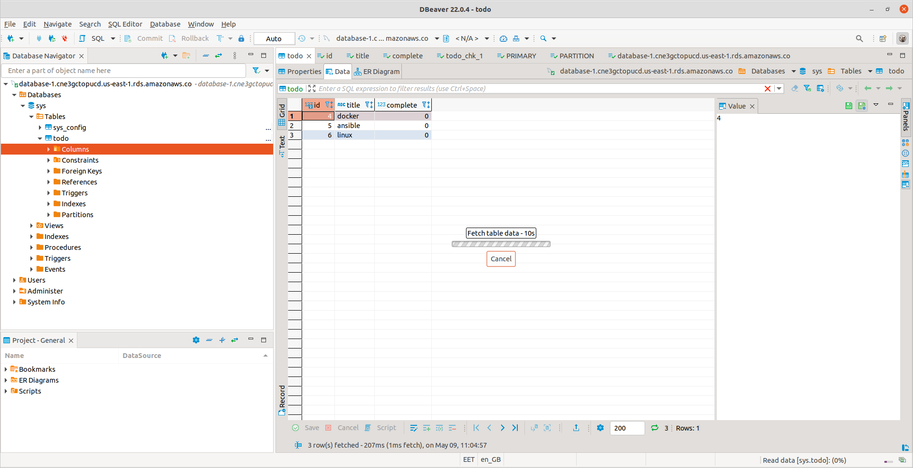
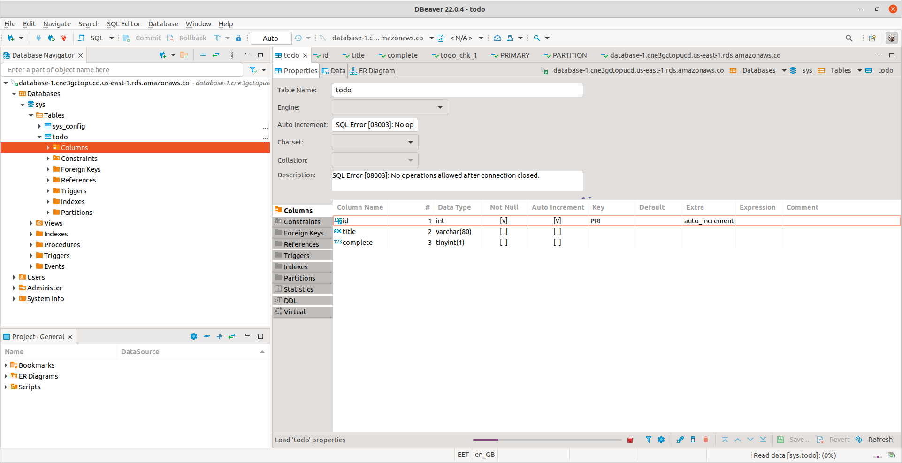

### Simple Flask Todo App

#### How to run the project local

- Create python3 virtual environment and activate it (python3 -m venv venv)
- Run '. venv/bin/activate'
- Run 'pip install -r requirements.txt' on terminal
- Run 'python app.py' on terminal for start local server
- To stop the server press Ctrl + C
- To Exit from the virtual environment type 'deactivate' and press Enter

#### Required Tasks

[ ] Push the project to github
[ ] make some changes on index.html, commit changes and push the changes to your repo.
[ ] connect the project to AWS RDS Server

[ ] write the app dockerfile
[ ] push the image to ECR
[ ] building and pushing the image using CircleCI